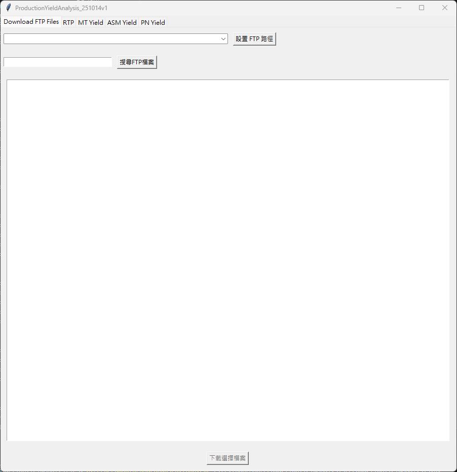

<<<<<<< HEAD
# \# Production Yield Analysis

# 

# A Python-based production yield analysis tool for automating CSV data processing and report generation.

# 

# \---

# 

# \## Features

# 

# \- CSV data automation

# \- Yield analysis

# \- Data filtering using pandas

# \- Tkinter GUI interface

# \- Report generation

# 

# \---

# 

# \## Technologies

# 

# \- Python

# \- pandas

# \- tkinter

# \- openpyxl

# 

# \---

# 

# \## Screenshot

# 

# !\[GUI](screenshots/main\_window.png)

# 

# \---

# 

# \## Installation

# 

# ```bash

# pip install -r requirements.txt

# ```

# 

# \---

# 

# \## Usage

# 

# ```bash

# python main.py

# ```

# 

# \---

# 

# \## Project Structure

# 

# ```text

# ProductionYieldAnalysis/

# │

# ├─ main.py

# ├─ requirements.txt

# ├─ README.md

# └─ screenshots/

# ```

# 

# \---

# 

# \## Author

# 

# Bochen Huang

=======
# Production Yield Analysis

A Python-based production yield analysis tool for automating CSV data processing and report generation.

---

## Features

- CSV data automation
- Yield analysis
- Data filtering using pandas
- Tkinter GUI interface
- Report generation

---

## Technologies

- Python
- pandas
- tkinter
- openpyxl

---

## Screenshot



---

## Installation

```bash
pip install -r requirements.txt
```

---

## Usage

```bash
python main.py
```

---

## Project Structure

```text
ProductionYieldAnalysis/
│
├─ main.py
├─ requirements.txt
├─ README.md
└─ screenshots/
```

---

## Author

Bochen Huang
>>>>>>> a08b94b4cbf97f6b7aedc453dddf588683d7d077
